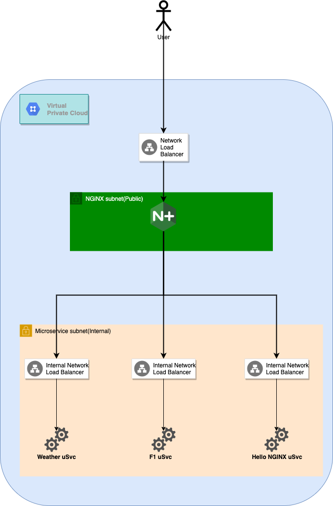

# gcp-nginx-plus-with-nlb
This project is to create GCP infrastructure usign Terraform to deploy nginx plus as API Gateway and load balanced with NLB

## Pre-requisite 
    1. Build the nginxplus image using packer , follow the instruction here https://github.com/b-rajesh/nginxplus-packer-image-builder
    2. Build the following microservices image using packer, follow the instructions on each
       1. https://github.com/b-rajesh/hello-nginxplus
       2. https://github.com/b-rajesh/hello-f1
       3. https://github.com/b-rajesh/weather-api

    3. Replace `terraform.tfvars` values with your `project_id` , `region` and other variables. Your  `project_id` &  `region`  must match the project you've initialized gcloud with.


## Install appropriate GCP tools
First, install the Google Cloud CLI
    Install gcloud sdk  - <Google Cloud SDK 284.0.0>

Initialize it...
```sh
$ gcloud init
```

gcloud Configure
```sh
$ gcloud auth login
```

Configure glcoud to work with your Terraform.
```sh
$ gcloud auth application-default login
```


## Initialize Terraform workspace
Initalize your Terraform workspace, which will download the provider and initialize it with the values provided in the terraform.tfvars file.

```sh

$ terraform init

Initializing the backend...

Initializing provider plugins...

The following providers do not have any version constraints in configuration,
so the latest version was installed.

To prevent automatic upgrades to new major versions that may contain breaking
changes, it is recommended to add version = "..." constraints to the
corresponding provider blocks in configuration, with the constraint strings
suggested below.

```

Then, run plan terraform plan.
```sh
$ terraform plan

# Output truncated...

Plan: 33 to add, 0 to change, 0 to destroy.
```

Run terraform apply. This will take approximately 10 minutes after your type yes - depends where you are running
```sh
# Output truncated...

Do you want to perform these actions?
  Terraform will perform the actions described above.
  Only 'yes' will be accepted to approve.

  Enter a value:
```

Output of the successful apply will look like this
```sh
# Output truncated...

Apply complete! Resources: 38 added, 0 changed, 0 destroyed.

Outputs:
# Output truncated...
```

## Highlevel Architecture

